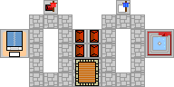

# Walkers

The whole of the C3 engine relies on walkers, and understanding their behaviour is a vital part of playing the game. This three-page article will help you do just that.

## Introduction

Walkers are an essential part of the C3 engine, and one of the major changes to the game from C2. They provide all the services necessary for housing evolution (except for water) as well as those necessary for the general maintenance of all buildings. Learning how walkers work is a vital part of the game that is not really adequately treated in the manual. For a start, there are two types of walkers in the game (three if you count Schoolchildren), which are usually known as Random Walkers and Destination Walkers. These types of walkers behave in very different ways.

### Random Walkers

Examples of random walkers include Prefects, Engineers, Tax Collectors, Librarians, Doctors, Priests, and (most important of all) Labour-Seeking Walkers. Random Walkers are generated by their respective buildings, and then set out on a patrol. Every time they reach an intersection, they choose which way to go based on a quasi-random pathing algorithm. This algorithm makes it unlikely (so I've been told) that a walker will follow the same path on every patrol. The length of the patrol can vary, as discussed on this page, but is always at least 26 tiles. Once the limit of the patrol has been reached, the walker simply turns round and takes the shortest possible route back to the building that generated it. After a short delay, the walker is respawned and sets out along a (hopefully) different path the next time.

### Destination Walkers

Destination walkers include Cartpushers, Performers going from Performer School to Venue, and Soldiers. When a destination walker is generated, it has a fixed destination. Cartpushers are heading to a specific Warehouse, Granary or Workshop; Performers are heading to a specific Venue; Soldiers are heading to a Fort (or wherever else you told them to go). The destination walker takes the shortest possible route to that destination. Although the majority of destination walkers need roads, there are a few that do not. The most obvious example is soldiers, but there are others: Prefects fighting a fire or engaging the enemy; Warehouse Cartpushers who have been instructed to 'get' a specific item (note that the distribution of raw materials or foodstuffs by a warehouse always requires roads regardless of the warehouse special orders).

### Schoolchildren

No discussion of walkers would be complete without a brief mention of Schoolchildren. They constitute a unique class of walker. Schoolchildren are generated by a School in batches of four. The four children run off down the road for a distance of no more than 22 tiles, at the end of which they simply disappear. They follow exactly the same path every time they are spawned. The four walkers are supposed to attempt to go in the four possible compass directions, but their behaviour does seem to depend on the exact location of the School on the map, and the surrounding road network. Occasionally you may find that all four children run off in the same direction. In such cases it may be necessary to move the School in order to attain the desired coverage.

## Walker Control

Before reading this article, it is essential that you are familiar with the terminology used ('random' and 'destination' walkers). This terminology is reasonably commonplace, but is explained in a bit more detail here.

### Random Walkers

The greatest problem in controlling random walkers is their behaviour when they encounter intersections. While the pathing algorithm employed allegedly limits the chance of a random walker repeatedly choosing the same path, it can, of course, happen. In my experience, Murphy's Law may be applied to C3: random walkers have an irritating habit of invariably choosing the 'wrong' path.

The solution I have adopted to this problem is to remove the element of choice altogether. I limit the number of intersections on the route of my random walkers to the minimum possible. The vast majority of walkers in my cities never encounter an intersection, and where they do, their choice of path is never critical to the stability of the city.

'How do you do this?', I hear you ask. Granted, it is impossible to build a city of any size with no intersections at all, but it is possible to disguise intersections. Random walkers will not pass through gatehouses, so you can, by careful placement of gatehouses, restrict the movement of random walkers. An example is shown in the diagram below, where the prefect will remain confined to the left hand loop and the engineer to the right hand loop:

In this set-up, the bath house will be protected from collapse, the temple from fire, and the houses from both fire and collapse. The houses will also have access to both the bathhouse and the temple.

My cities typically employ a set of closed loops of road interconnected via gatehouses. Where the terrain does not permit the construction of closed loops, I tend to build long, intersectionless, roads instead. The reason I like to use closed loops is because if the loop length is less than 50 tiles, then random walkers should circle the loop on every patrol (when they reach the end of their patrol, the walkers take the shortest distance back home, which is around the rest of the loop!).

### Destination Walkers

Unlike those of random walkers, the routes of destination walkers are predictable. Given a choice of several warehouses accessible by road, a Workshop Cartpusher will deliver to the nearest one (determined 'as the crow flies' - the distance by road may well be enormous); Performers will go to the nearest Venue that has no shows; farms deliver to the nearest Granary or Warehouse with space.

The last, and most crucial point about destination walkers is that they are wholly unaffected by Gatehouses. If a Gatehouse bars their way, they simply march right through it. The only way to stop destination walkers getting somewhere is to ensure that there is no road connection to that part of the city (but note the important exception of Warehouse Cartpushers 'getting' goods). The sole method of controlling destination walkers is to fix their spawning points and final destinations by careful placement of the relevant buildings.

## Walker Data

Inspired by my analogous work for Zeus, and to satisfy my own curiosity, I decided to investigate the behaviour of random walkers in C3. of particular interest for me was the length of a random walkers patrol, since this has ramifications for the design of housing blocks.

The structure of the test was as follows: a long road was constructed, and buildings placed at one end of it, such that their entry/exit point was unambiguously fixed as the end tile of the road. To aid counting, small statues were placed at five tile intervals along the side of the road. The length of the patrol was marked using a plaza tile. As you shall see, my results were gratifyingly simple.

Since this seems like a sensible place to put it, I have added the results of work by a number of others on walker speed.

### Patrol Lengths

In all of my observations, which spanned several game years, I only observed four different lengths for a random walker patrol: 52 tiles, 43 tiles, 35 tiles, and 26 tiles (in all cases, this does not include the tile on which the walker is spawned). Each walker exhibited two patrol lengths, which I shall call the short and long patrol lengths. The long patrol was always in the length bracket immediately above that of the short patrol (i.e. if the short patrol length was 35 tiles, the long patrol length was always 43 tiles; if the short patrol length was 43 tiles, the long patrol length was 52 tiles). Over a period pf time, the walkers would make a long patrol approximately once in every four journeys.

The situation becomes rather more complicated when the walker is permitted to emerge from the building and head in either direction. Although the patrol lengths did tend to follow the 3 short: 1 long pattern described above, there was no discernible pattern in the combination of patrol length and direction. Sometimes walkers would repeatedly exit the buildings in the same direction, while on other occasions they would exit in either direction with almost equal probability.

The following table lists the long and short patrol lengths in tiles for all the random walkers found in the game

| Walker            | Long  | Short | Walker            | Long  | Short |
| :---------------- | :---: | :---: | :---------------- | :---: | :---: |
| **Prefect**       |  52   |  43   | **Barber**        |  35   |  26   |
| **Engineer**      |  52   |  43   | **Bath Lady**     |  35   |  26   |
| **Actor***        |  43   |  35   | **Doctor**        |  35   |  26   |
| **Gladiator***    |  43   |  35   | **Surgeon**       |  35   |  26   |
| **Lion Tamer***   |  43   |  35   | **Teacher**       |  35   |  26   |
| **Charioteer***   |  43   |  35   | **Librarian**     |  35   |  26   |
| **Tax Collector** |  43   |  35   | **Market Trader** |  35   |  26   |
| **Priest**        |  35   |  26   | **Labour seeker** |  35   |  26   |

\* These are the entertainment walkers generated by the venues, not those generated by performer schools, which do not behave as random walkers.

The most important ramification of this information is in the design of Housing Blocks. The furthest distance that you can rely on most walkers travelling is 26 tiles. Consequently, closed loop designs with a loop less than or equal to 52 tiles should guarantee walker coverage from every building except Schools (Schoolchildren do not behave as random walkers). Industrial blocks based on a 50-tile or less loop should also guarantee labour access provided there are sufficient houses (2 or 3 should suffice) on that loop.

### Walker Speed

The current accepted opinion, the result of painstaking work by, amongst others, catilina, a Caesar 3 Heaven regular, is that all non-military walkers move with a speed of 640 tiles per year.
